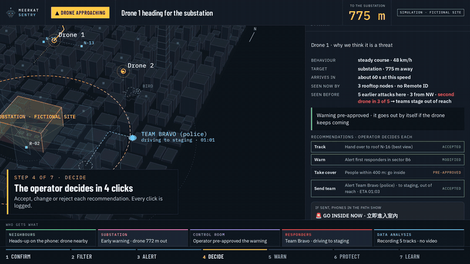
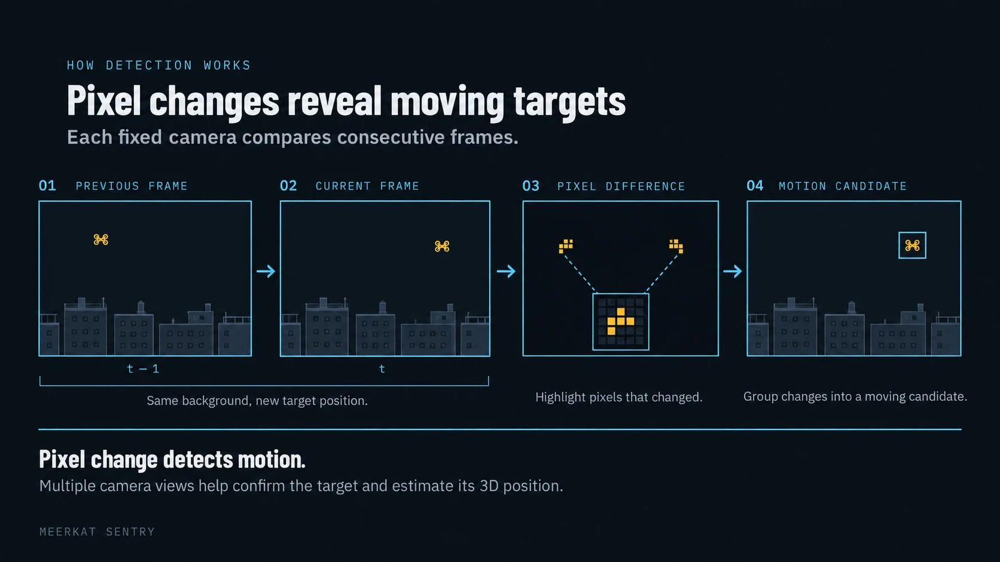
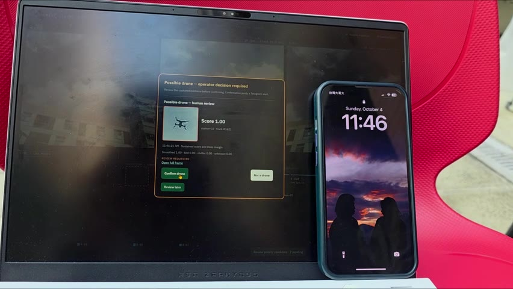
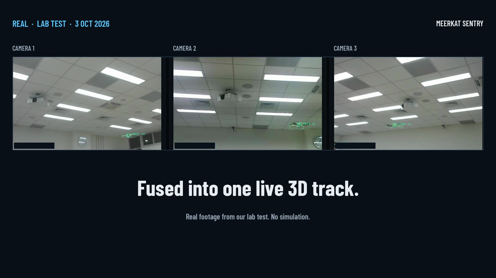
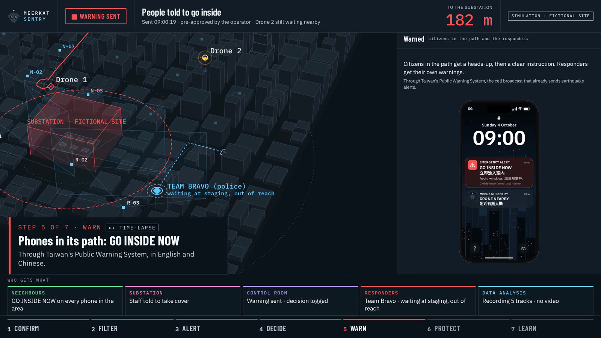
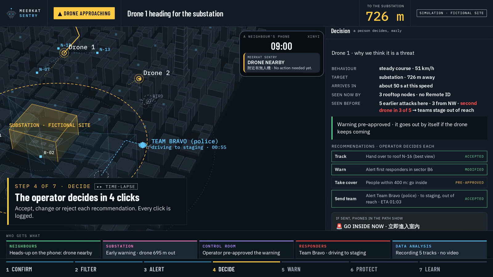
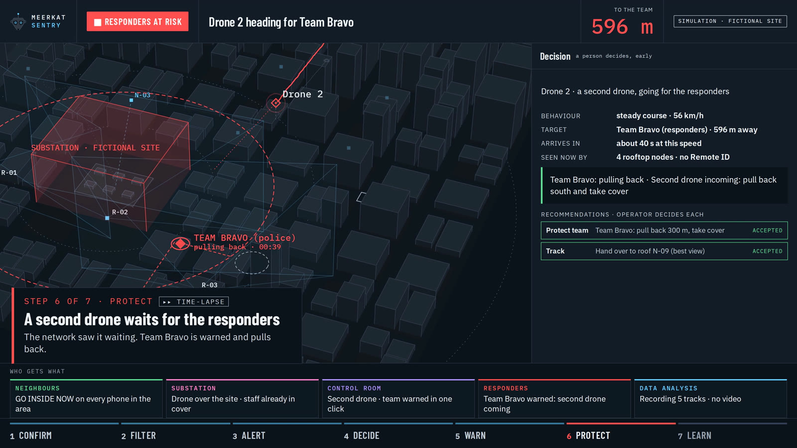
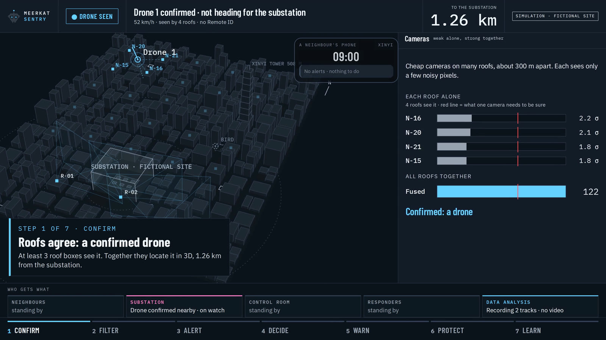
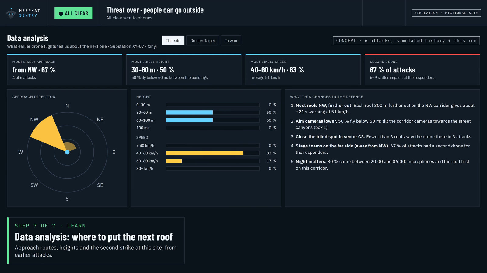

<p align="center"></p>

<h1 align="center">Meerkat Sentry</h1>
<p align="center"><b>Every roof keeps watch.</b> 每個屋頂，都在守望。</p>
<p align="center">Team 08 · European Defense Tech Hackathon (EDTH) · Taipei, 2–4 Oct 2026 · Challenge 04: low-cost drone detection, tracking and response decision support</p>

<p align="center">
  <a href="https://janbarkemeyer.github.io/meerkat-sentry/"><b>Website and video</b></a> ·
  <a href="https://janbarkemeyer.github.io/meerkat-sentry/meerkat_vision.html"><b>Live demo</b></a> (laptop) ·
  <a href="real-test.mp4"><b>Real outdoor test (24 s)</b></a> ·
  <a href="meerkat-sentry-deck.pdf"><b>Pitch deck (PDF)</b></a>
</p>


<p align="center"><sub>Simulation of the finished system in a fictional neighbourhood. The lab system below is real.</sub></p>

## The problem

In a city, small drones fly below the roofs, where radar has no line of sight. In Ukraine, such drones hit power stations first, then the crews who come to repair them. In Taipei, those sites sit between high-rises and homes.

## The idea

Cheap camera boxes on many roofs look along the streets.

1. **See.** Each roof box has 2–6 ordinary cameras. Video stays in the box; only detections leave it.
2. **Confirm.** One camera alone sees a few noisy pixels. When **3 roofs** see the same object, it is a confirmed drone, located in 3D. Birds, balls, registered drones (Remote ID) and objects on the ground are filtered before anyone sees them.
3. **Decide.** An operator gets one alert with the reason in plain words (speed, course, time to target, how many roofs see it) and accepts, changes or rejects each recommendation: track, warn, take cover, send a team. Every decision is logged.
4. **Warn.** People in the drone's path are told to go inside. In the real product this goes through Taiwan's Public Warning System, like an earthquake alert; our demo uses a Telegram group. Responders get their own warning.



We add to radar where it is blind; we do not replace it. No weapon control: warnings and team allocation only.

## What we built in 48 hours

| | Status |
|---|---|
| 3 Raspberry Pi camera nodes + a controller that fuses them into one 3D track (15–20 fps, 23 ms median camera → fusion) | **real**, lab |
| 20 of 20 indoor test flights detected; a drone counts as confirmed only when 3 cameras see it | **real**, lab |
| Filter rules: birds, balls, registered drones (Remote ID), people on the ground | **built**; tested in the simulation and with recorded controller data |
| Operator dashboard: alert rules, recommendations, accept / reject / modify, decision log with CSV export | **built** |
| Phone warning in English and Chinese, sent to real phones through a Telegram demo group | **real**, demo channel |
| Outdoor test, 4 Oct: a camera spots a drone against the sky, an image check scores it, the operator confirms, the phone gets the alert | **real**; this alert came from one station, outdoor 3D fusion is next |
| Recording and replay of controller runs through the same rules | **built**; not yet tested with a full real flight |
| City neighbourhood with 24 roof boxes, a second drone aimed at the responders, data analysis without video | **simulation**, clearly labelled |

### Real test, 4 Oct 2026

<a href="real-test.mp4"></a>

<sub>Real, outdoors on campus: a camera spots the drone against the sky, an image check scores it, the operator presses <b>Confirm drone</b>, and the phone gets the alert through our Telegram demo group. <a href="real-test.mp4">Video (24 s)</a></sub>

<table>
<tr>
<td width="50%"><br><sub><b>Real:</b> our lab test, 3 Oct 2026. All three cameras mark the same drone. <a href="lab-real.mp4">Video (8 s)</a></sub></td>
<td width="50%"><br><sub><b>Simulation:</b> phones in the drone's path get GO INSIDE NOW. <a href="vision.mp4">Video (33 s)</a></sub></td>
</tr>
<tr>
<td><br><sub>The operator decides in 4 clicks. Pre-approving the warning gives people <b>34 s instead of 26 s</b> to get inside.</sub></td>
<td><br><sub>A second drone waits for the responders. The network sees it waiting and warns Team Bravo in time.</sub></td>
</tr>
<tr>
<td><br><sub>Weak alone, strong together: each roof below the threshold, the fused score above it.</sub></td>
<td><br><sub>Every incident teaches the network: where drones come from, where they wait, where a roof is missing. Tracks only, never video, never sold.</sub></td>
</tr>
</table>

## Try it

**In the browser:** open the [live demo](https://janbarkemeyer.github.io/meerkat-sentry/meerkat_vision.html) on a laptop and press **Play demo**. The **H** key shows the shortcuts and **W** switches to [what already works](https://janbarkemeyer.github.io/meerkat-sentry/meerkat_today.html), the real lab measurements. Both pages are single HTML files that run offline, with no install and no internet.

**Locally:** download `meerkat_vision.html` and double-click it.

## Honest status

- **Not measured yet:** outdoor range and false-alarm rate. That is the first job of a pilot on real roofs.
- **Outdoor fusion:** in our outdoor test the alert came from one station plus an image check. Fusing several roofs into one 3D track outdoors is the next step; indoors it works.
- **Night and fog:** cheap cameras do not see the sky at night. Next step: thermal cameras and microphones in the same box. A drone confirmed by sight, heat and sound means fewer false alarms and earlier detection.
- **Cost:** one roof box is about $345 in off-the-shelf parts today (no core part made in the PRC); about $100 is the target at volume.

## Business model

Our customers are **households**. Main case: a community project in which neighbours put a box on their own roof and pay only for the box, at cost. Critical sites such as power and water can add a ring of boxes. Option 2: a subscription of NT$1,200 a month with a 12-month minimum, so that from month 13 it pays for repairs and data analysis. Video never leaves the box, and the data is never sold.

## Repository

```
index.html             website: video, how it works, screenshots, team
meerkat_vision.html    live demo: the city concept (simulation, guided presentation)
meerkat_today.html     what already works: real lab measurements
dashboard_src.html     source of both demo pages (plain HTML, CSS and JavaScript, no framework)
build.py               rebuilds both demo pages from the source and embeds the fonts: python3 build.py
*.mp4, *.jpg, *.gif    videos and screenshots
meerkat-sentry-deck.pdf  pitch deck
```

The camera nodes and the fusion controller were built by Edoardo Dominikus and Sean Ching and are not in this repository. The dashboard reads the controller's live feed (`/live.json`) and applies its own rules: a track only counts as a drone when 3 stations support it, and nothing below 1.4 m (people) raises an alert.

## Team 08

Jan Barkemeyer · Robin Fischer · Edoardo Dominikus · Sean Ching · Ching Hsu

Camera nodes and fusion controller: Edoardo Dominikus and Sean Ching. Operator dashboard (alert rules, recommendations, decision log, phone warning), city simulation and pitch deck: Jan Barkemeyer, who maintains this repository. Pitch on stage: Robin Fischer.

Built at the [European Defense Tech Hackathon](https://events.eurodefense.tech/taiwan-defense-tech-hackathon), Taipei 2026.

---

© 2026 Team 08 Meerkat Sentry. All rights reserved. Shared for viewing; please ask before reusing.
